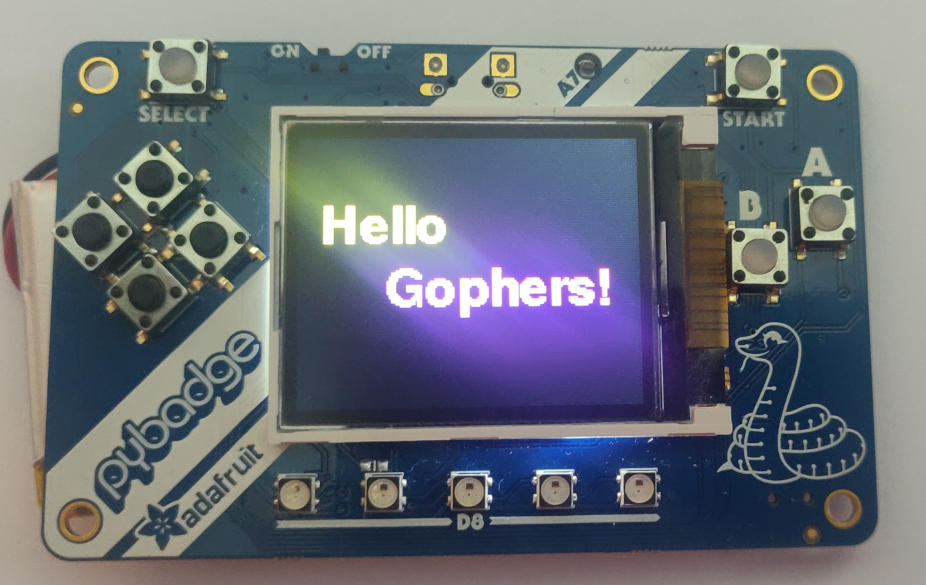
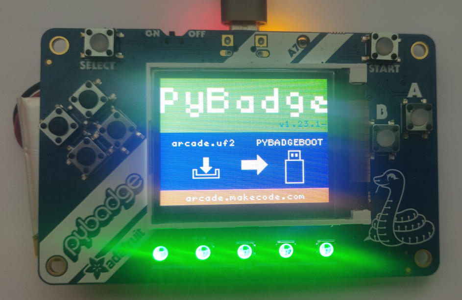
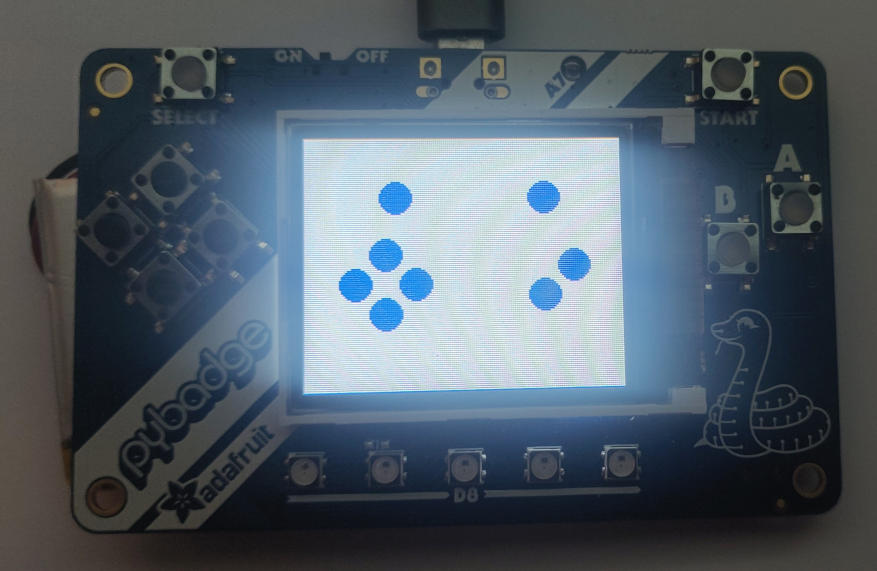
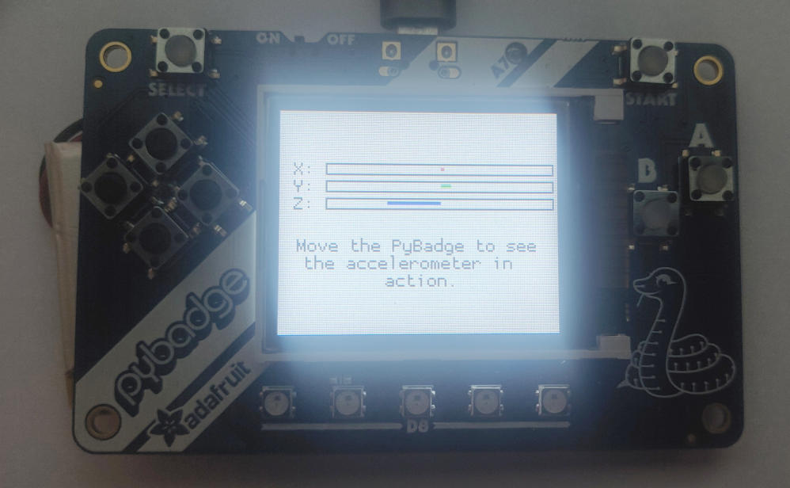
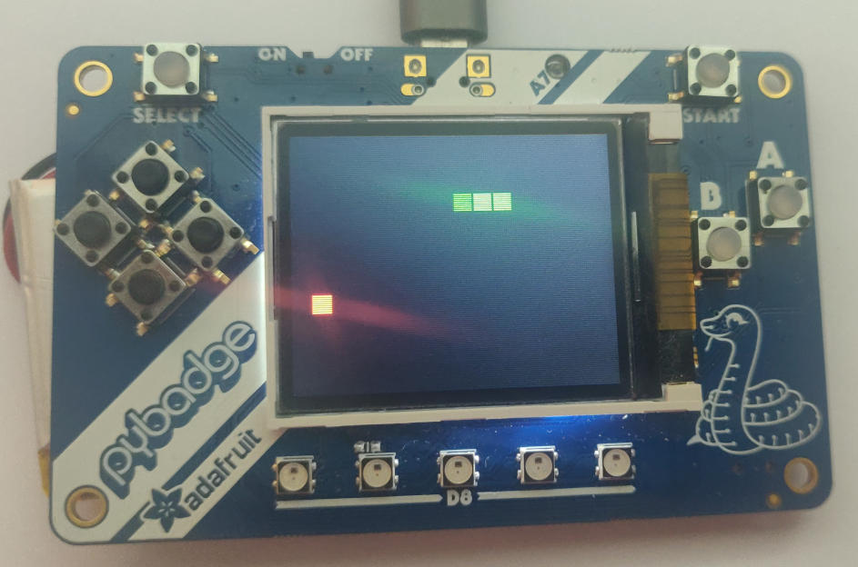
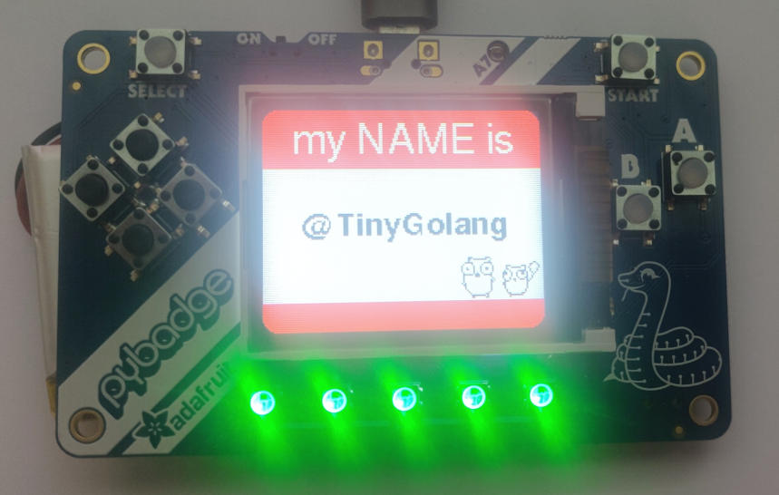

# GoBadge Workshop

## What you need

    - Adafruit's PyBadge
    - Personal computer with Go 1.13+ and TinyGo installed, and a serial port.

## Installation

### Go 1.13

If somehow you have not installed Go 1.13 on your computer already, you can download it here:

https://golang.org/dl/

Now you are ready to install TinyGo.

### TinyGo

Follow the instructions here for your operating system:

https://tinygo.org/getting-started/

Once you have finished installing TinyGo itself, install the drivers needed for the 

### TinyGo drivers

To install the various drivers and other code dependencies run these commands:

```
go get -u tinygo.org/x/drivers
go get -u tinygo.org/x/tinydraw
go get -u tinygo.org/x/tinyfont
```

### Bossa

In order to "flash", meaning to move the binary code from your computer to the PyBadge, you must install the "bossac" command line utility which is part of BOSSA.

#### Linux

On Linux, install from source:

```
sudo apt install \
  libwxgtk3.0-dev \
  libreadline-dev
git clone https://github.com/shumatech/BOSSA.git
cd BOSSA
make
```

#### macOS

On macOS, you can install it via `brew cask install bossa` or download the installer from https://github.com/shumatech/BOSSA/releases/download/1.9.1/bossa-1.9.1.dmg

One you have downloaded it, double click on the .dmg file to perform the installation.

#### Windows

- You must install the "BOSSA" flashing utility first. You can download it from https://github.com/shumatech/BOSSA/releases/download/1.9.1/bossa-x64-1.9.1.msi

- During the installation, you should choose to put it into `c:\Program Files`. NOTE: this is not the default, you will have to change the value during the install process.

- After the installation, you must add it to your PATH:

    ```shell
    set PATH=%PATH%;"c:\Program Files\BOSSA";
    ```

- Test that you have installed "BOSSA" correctly by running this command:

    ```shell
    bossac --help
    ```

## Connecting the PyBadge to your computer



Plug the PyBadge into your computer using a USB cable. There may be one provided in your starter kit.

## Running the code

The TinyGo programs will run directly on the PyBadge's microcontoller. The procedure is basically:

- Edit your TinyGo program.
- Compile and flash it to your PyBadge.
- The program executes from the PyBadge. You can disconnect the PyBadge from your computer and plug it into a battery if you wish, the program executes directly on the microcontroller.

Let's get started!

## Code

### step0.go - Built-in LED

This tests that you can compile and flash your PyBadge with TinyGo code, by blinking the built-in LED (it's on the back).



- Click on the "RST" button two times to put the PyBadge into bootloader mode so you can load your own code onto it. The front neopixels will lit green and the screen will show a message to indicate that the PyBadge is ready to receive your code.

Run the following command to compile your code, and flash it onto the PyBadge:

```
tinygo flash -target pybadge ./step0/main.go
```

Once the PyBadge is flashed correctly, the built-in LED labeled "D13" (on the back) should start to turn on and off once per second. Now everything is setup correctly and you are ready to continue.

### step1.go - Built-in LED, START Button

Run the code.

```
tinygo flash -target pybadge ./step1/main.go
```

When you press the START button, the built-in LED should turn on.

### step2.go - Neopixels

Run the code.

```
tinygo flash -target pybadge ./step2/main.go
```

The 5 neopixels should light up green and red alternatively.

### step3.go - Neopixels, Buttons

Run the code.

```
tinygo flash -target pybadge ./step3/main.go
```

The 5 neopixels should light up in different colors depending on which button you press.

### step4.go - Light sensor, Neopixels

Step 4 has been temporarily removed from this workshop.

### step5.go - Display


Run the code.

```
tinygo flash -target pybadge ./step5/main.go
```

The message "Hello Gophers!" should appear on the display.

### step6.go - Display, Buttons



Run the code.

```
tinygo flash -target pybadge ./step6/main.go
```

The display will show some blue circles. When a button is pressed a ring will be shown around its corresponding circle.

### step7.go - Display, Accelerometer



Run the code.

```
tinygo flash -target pybadge ./step7/main.go
```

The display will show a bar for each X,Y,Z axis. Move the Pybadge to see it in action.

### step8.go - Buzzer, Buttons

Run the code.

```
tinygo flash -target pybadge ./step8/main.go
```

Press the buttons and create your melody.

### Snake Game



Run the code.

```
tinygo flash -target pybadge ./snake/main.go
```

Play the famous Snake game on the pybadge.

### My Name Is



Run the code.

```
tinygo flash -target pybadge ./mynameis/main.go
```

Configure your name and use the awesome TinyGo-powered badge!